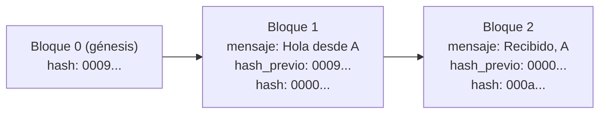
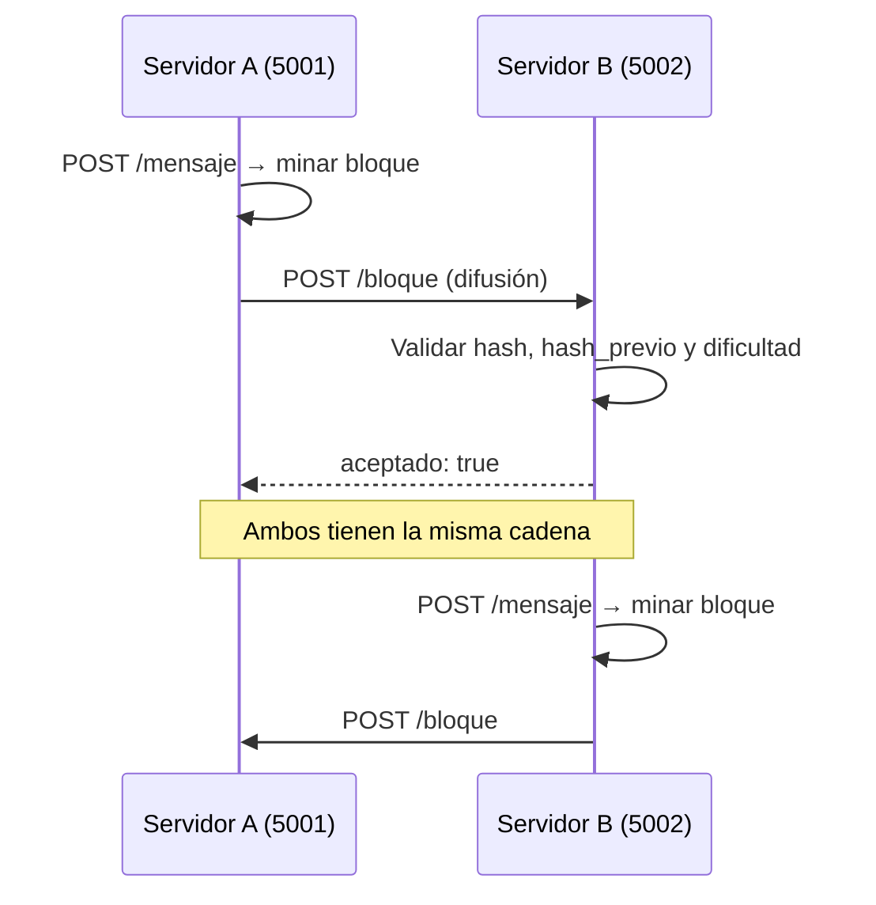
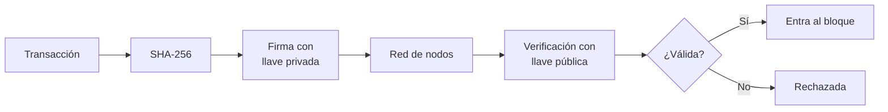
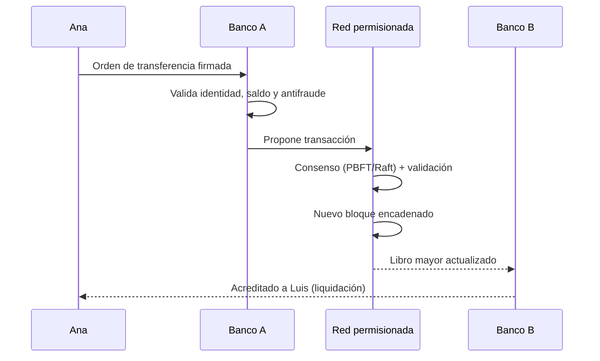
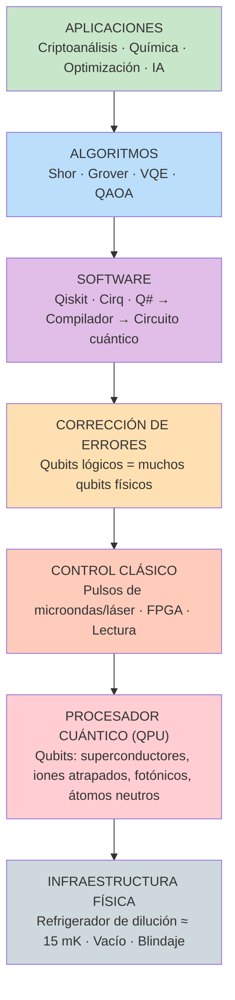
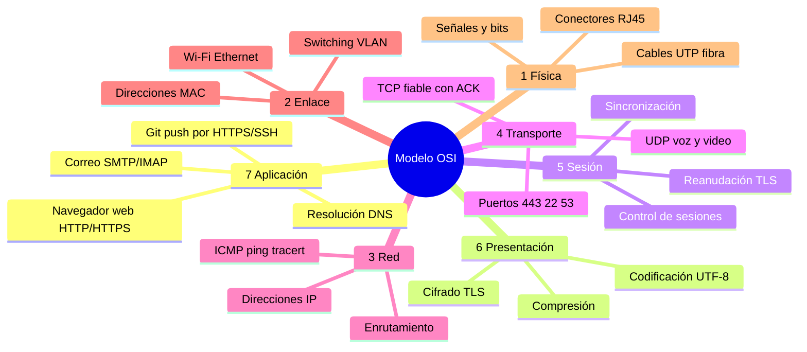
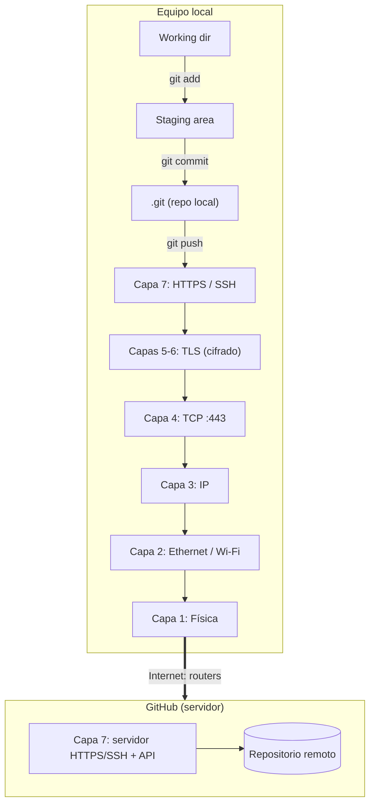
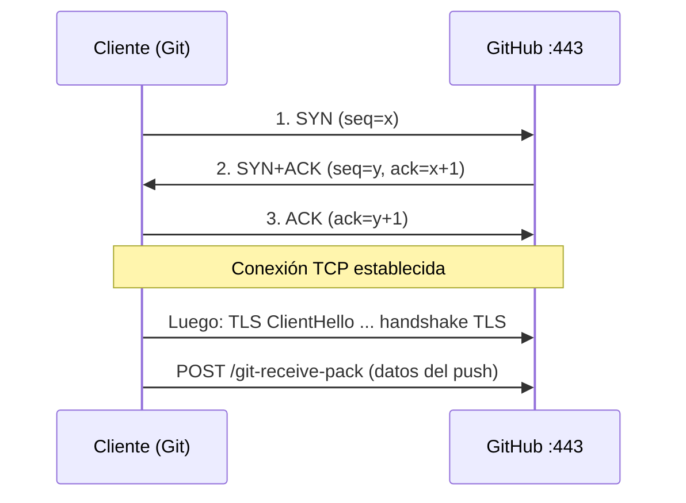
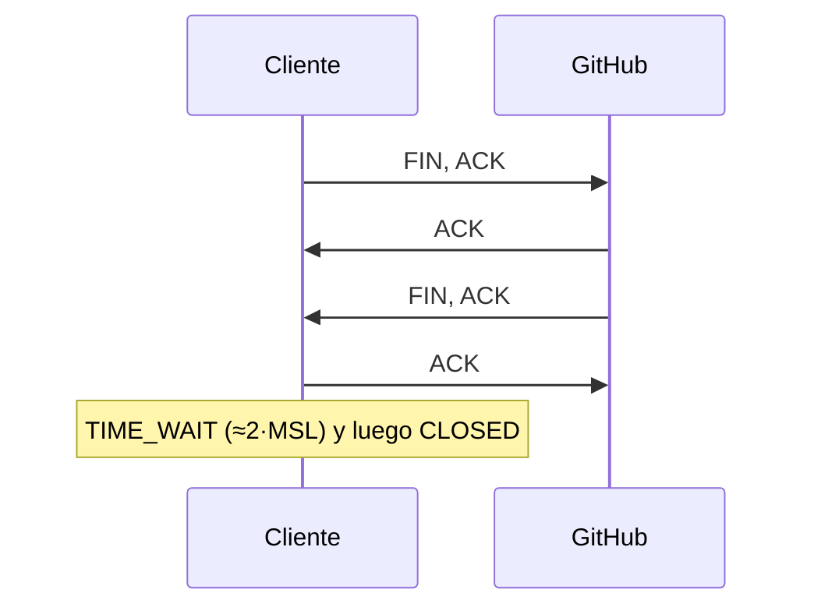

# lugo-valdes-
# Actividad 8 – Nuevas Tecnologías

**Instructor:** Diego Alejandro Barragán Vargas – SENA
**Temas:** Blockchain, criptografía, computación cuántica, modelo OSI, teletráfico y gestión de redes.

> Los diagramas están en **Mermaid**, que GitHub renderiza automáticamente dentro del README.

## Contenido

1. [Parte 1 – Blockchain y criptografía](#parte-1--blockchain-y-criptografía)
2. [Parte 2 – El viaje de un commit a GitHub (OSI)](#parte-2--el-viaje-de-un-commit-a-github)
3. [Ejercicio en clase – Gestión de redes convergentes](#ejercicio-en-clase--gestión-de-redes-convergentes)

Archivos del repositorio: `blockchain_mensajes.py`, `generador_plantillas.py`, `README.md`.

---

# Parte 1 – Blockchain y criptografía

## 1.1 Cadena de bloques con mensajes entre dos servidores

### ¿Cómo se crea un bloque?

Un bloque es un registro con estos campos:

| Campo | Función |
|---|---|
| `index` | Posición en la cadena |
| `timestamp` | Momento de creación |
| `mensaje` | Datos útiles (emisor, receptor, texto) |
| `hash_previo` | Hash del bloque anterior; es lo que **encadena** los bloques |
| `nonce` | Número que el minero va cambiando |
| `hash` | SHA-256 de todos los campos anteriores |

Pasos para crear un bloque:

1. Se toma el mensaje y el hash del último bloque de la cadena.
2. Se arma el bloque con `index`, `timestamp`, `mensaje`, `hash_previo` y `nonce = 0`.
3. Se calcula `SHA-256(contenido)`.
4. **Prueba de trabajo:** mientras el hash no empiece con `000` (dificultad 3), se incrementa el `nonce` y se recalcula.
5. Cuando el hash cumple la condición, el bloque está "minado" y se agrega a la cadena local.
6. Se difunde el bloque a los demás nodos.
7. Cada nodo lo **valida** (índice correcto, `hash_previo` coincide, hash recalculado coincide, cumple la dificultad). Si es válido lo agrega.

Si alguien altera un mensaje antiguo, cambia el hash de ese bloque, se rompe el `hash_previo` del siguiente y toda la cadena posterior queda inválida. Esa es la propiedad de **inmutabilidad**.



### Funcionamiento entre los dos servidores



Si un nodo está desactualizado (rechaza un bloque), pide la cadena completa a su par y aplica la **regla de consenso: gana la cadena válida más larga**.

### Ejecución paso a paso

El código completo está en [`blockchain_mensajes.py`](blockchain_mensajes.py) y usa solo la librería estándar de Python 3.

```bash
# Terminal 1 (Servidor A)
python blockchain_mensajes.py 5001 5002
# Terminal 2 (Servidor B)
python blockchain_mensajes.py 5002 5001

# Terminal 3: enviar mensajes
curl -X POST localhost:5001/mensaje -H "Content-Type: application/json" \
     -d '{"de":"Servidor A","para":"Servidor B","texto":"Hola desde A"}'
curl -X POST localhost:5002/mensaje -H "Content-Type: application/json" \
     -d '{"de":"Servidor B","para":"Servidor A","texto":"Recibido, A"}'

# Ver la cadena en ambos nodos y validarla
curl localhost:5001/cadena
curl localhost:5002/cadena
curl localhost:5001/validar
```

**Resultado de la prueba:** ambos nodos terminan con 3 bloques (génesis, "Hola desde A", "Recibido, A") y `/validar` devuelve `{"valida": true}`.

Fragmento clave, la creación y minado de un bloque:

```python
class Bloque:
    def calcular_hash(self):
        return sha256({"index": self.index, "timestamp": self.timestamp,
                       "mensaje": self.mensaje, "hash_previo": self.hash_previo,
                       "nonce": self.nonce})

    def minar(self):                       # Prueba de trabajo
        while not self.hash.startswith("0" * DIFICULTAD):
            self.nonce += 1
            self.hash = self.calcular_hash()
```

---

## 1.2 ¿Qué tipo de encriptación se maneja en blockchain y cómo funciona?

Blockchain **no cifra los datos** de los bloques, que suelen ser públicos. Usa criptografía para garantizar **integridad, autenticidad y no repudio**:

| Técnica | Tipo | Para qué se usa en blockchain |
|---|---|---|
| **Funciones hash** (SHA-256, Keccak-256) | Resumen unidireccional | Encadenar bloques, prueba de trabajo, identificar transacciones |
| **Criptografía asimétrica** (ECDSA secp256k1, Ed25519) | Par de llaves pública/privada | Firmar transacciones y demostrar propiedad de fondos |
| **Árboles de Merkle** | Hash jerárquico | Verificar que una transacción está en un bloque sin descargarlo todo |
| **Simétrica** (AES) y **TLS** | Llave compartida | Cifrar la comunicación entre nodos y la custodia de wallets (fuera de la cadena) |
| **ZK-proofs** (opcional, p. ej. Zcash) | Pruebas de conocimiento cero | Privacidad de transacciones |

**Cómo funciona la firma digital:**

1. El usuario genera una **llave privada** (secreta) y de ella deriva una **llave pública**.
2. La **dirección** (wallet) se obtiene aplicando hash a la llave pública.
3. Para enviar una transacción, se calcula el hash de la transacción y se **firma con la llave privada**.
4. Cualquier nodo **verifica** la firma con la llave pública. Si coincide, la transacción es auténtica y no fue alterada.
5. Nadie puede falsificar la firma sin la llave privada.



---

## 1.3 Cadena de bloques en una transacción bancaria

Los bancos usan normalmente **blockchains permisionadas** (Hyperledger Fabric, R3 Corda, Quorum). Solo participan nodos autorizados y se identifican con certificados.

Ejemplo: el cliente Ana (Banco A) transfiere 1.000.000 COP a Luis (Banco B).

1. Ana ordena la transferencia desde su app y la **firma** con su llave.
2. El Banco A valida identidad (KYC), saldo y fraude.
3. La transacción se propaga a los nodos de la red (Banco A, Banco B, regulador, cámara de compensación).
4. Los nodos validadores la verifican (firma, saldo, reglas) con un consenso rápido (PBFT/Raft en vez de minería).
5. La transacción entra a un **bloque** que se encadena con el anterior y se replica en todos los nodos.
6. El libro mayor queda actualizado: el saldo de Ana baja y el de Luis sube, con **liquidación casi inmediata** (frente a días en el sistema tradicional).
7. Ambos bancos y el regulador consultan el mismo registro, inmutable y auditable.



**Beneficios:** trazabilidad, menos conciliaciones, menor costo y tiempo, auditoría. **Retos:** privacidad (canales privados), regulación, escalabilidad e interoperabilidad.

---

## 1.4 ¿Cómo se comporta blockchain ante la computación cuántica?

| Componente | Algoritmo cuántico | Efecto | Riesgo |
|---|---|---|---|
| Firmas (ECDSA, RSA) | **Shor** | Deriva la llave privada desde la pública en tiempo polinomial | **Alto**: se podrían robar fondos y falsificar transacciones |
| Hash (SHA-256) | **Grover** | Reduce la seguridad efectiva a la mitad (256 → ~128 bits) | **Bajo/Medio**: sigue siendo seguro; se compensa usando hashes más largos |
| Minería (PoW) | Grover | Aceleración cuadrática de la búsqueda de nonce | Medio: ventaja para quien tenga hardware cuántico |
| Cifrado simétrico (AES-256) | Grover | ~128 bits efectivos | Bajo |

El riesgo real está en las **firmas**. Una dirección es más vulnerable cuando su llave pública ya fue expuesta, por ejemplo tras gastar fondos. Los datos guardados hoy pueden ser descifrados mañana ("*harvest now, decrypt later*").

**Mitigaciones:**

- Migrar a **criptografía post-cuántica (PQC)** estandarizada por NIST en 2024: **ML-DSA** (FIPS 204) y **SLH-DSA** (FIPS 205) para firmas, **ML-KEM** (FIPS 203) para intercambio de llaves.
- Firmas basadas en hash (SPHINCS+/XMSS).
- No reutilizar direcciones.
- **Cripto-agilidad**: diseñar la cadena para poder cambiar algoritmos mediante un *fork*.
- Usar SHA-384/512 y AES-256.

---

## 1.5 ¿Qué es la computación cuántica y qué seguridad utiliza?

La **computación cuántica** procesa información con **qubits** y aprovecha tres fenómenos de la mecánica cuántica:

- **Superposición:** un qubit puede ser 0 y 1 a la vez, con probabilidades.
- **Entrelazamiento:** qubits correlacionados que no se pueden describir por separado.
- **Interferencia:** se amplifican los resultados correctos y se cancelan los incorrectos.

No es "más rápida en todo": solo supera a los computadores clásicos en problemas concretos (factorización con Shor, búsqueda con Grover, simulación molecular, optimización).

### Tipos de seguridad

| Tipo | Base | Cómo funciona | Ejemplos | Resiste a Shor/Grover |
|---|---|---|---|---|
| **Criptografía clásica asimétrica** | Factorización / logaritmo discreto | Llaves pública/privada | RSA, ECC, ECDSA, DH | No (Shor) |
| **Criptografía simétrica** | Permutaciones y sustituciones | Llave compartida | AES-256, ChaCha20 | Sí, duplicando la llave |
| **PQC basada en retículos** | Problemas de retículos (LWE) | Ruido sobre sistemas lineales | ML-KEM (Kyber), ML-DSA (Dilithium) | Sí |
| **PQC basada en hash** | Resistencia de las funciones hash | Firmas de un solo uso en árbol | SLH-DSA (SPHINCS+), XMSS, LMS | Sí |
| **PQC basada en códigos** | Decodificación de códigos lineales | Corrección de errores | Classic McEliece, HQC | Sí |
| **PQC multivariada / isogenias** | Ecuaciones polinómicas / isogenias | Problemas difíciles en curvas | Rainbow (roto), SIKE (roto) | Descartados o en revisión |
| **QKD (distribución cuántica de llaves)** | Leyes de la física | Los fotones transportan la llave; medirlos la altera y delata al espía | BB84, E91 | Sí (seguridad teórica) |
| **QRNG** | Aleatoriedad cuántica | Genera números verdaderamente aleatorios | Generadores de fotones | Complementa a los demás |

### Infografía: arquitectura de la computación cuántica



```
 ┌──────────────────────────────────────────────────────────────┐
 │  SUPERPOSICIÓN        ENTRELAZAMIENTO       INTERFERENCIA    │
 │  |ψ⟩ = α|0⟩ + β|1⟩    |00⟩ + |11⟩           amplifica lo     │
 │                                             correcto         │
 ├──────────────────────────────────────────────────────────────┤
 │   Puertas: H · X · CNOT  →  Medición  →  resultado clásico   │
 └──────────────────────────────────────────────────────────────┘
```

---

# Parte 2 – El viaje de un commit a GitHub

## 2.1 Modelo OSI: las 7 capas

| # | Capa | Función | PDU | Protocolos / ejemplos | Dispositivo |
|---|---|---|---|---|---|
| 7 | **Aplicación** | Interfaz de servicios de red al usuario | Datos | HTTP, HTTPS, DNS, SSH, FTP, SMTP, SNMP, Git | Gateway de aplicación |
| 6 | **Presentación** | Formato, compresión, cifrado | Datos | TLS/SSL, JPEG, ASCII/UTF-8 | — |
| 5 | **Sesión** | Abrir, mantener y cerrar sesiones | Datos | NetBIOS, RPC, sesiones TLS | — |
| 4 | **Transporte** | Extremo a extremo, puertos, fiabilidad | Segmento (TCP) / Datagrama (UDP) | TCP, UDP | Firewall |
| 3 | **Red** | Direccionamiento IP y enrutamiento | Paquete | IP, ICMP, OSPF, BGP | Router |
| 2 | **Enlace de datos** | Direccionamiento MAC, acceso al medio, detección de errores | Trama | Ethernet, Wi-Fi 802.11, ARP, VLAN 802.1Q | Switch, AP |
| 1 | **Física** | Transmisión de bits | Bits | Cobre UTP, fibra, radio, voltajes | Hub, cable, NIC |

### Mapa conceptual: aplicación de cada capa



## 2.2 ¿Dónde están Git y GitHub en el modelo OSI?

- **Git** es un sistema de control de versiones local. Como programa vive en el **host** y trabaja sobre el sistema de archivos; no es un protocolo de red por sí mismo. Cuando hace `git push`, usa protocolos de **capa 7 (Aplicación)**: **HTTPS** (HTTP sobre TLS) o **SSH**. También existe el protocolo `git://` (puerto 9418), poco usado hoy.
- **GitHub** es un **servicio de capa 7**: servidores web/API que implementan el lado servidor de esos protocolos y alojan los repositorios.
- La **seguridad** se aporta en las capas 5/6 con **TLS** (o con el cifrado de SSH).



## 2.3 Mi colegio / entorno: OSI, ciberseguridad y criptografía

> **Nota:** este punto depende de **tu institución**. Lo que sigue es un **borrador con un entorno educativo típico**. Reemplázalo con lo que observes realmente (equipos, marcas, configuración) antes de entregar.

| Capa | Cómo se visualiza en el colegio (ejemplo) |
|---|---|
| Física | Cableado UTP Cat5e/Cat6 a salas de cómputo, fibra o enlace del ISP, puntos de acceso |
| Enlace | Switches administrables, VLAN (administrativa, docentes, estudiantes), WPA2/WPA3 en el Wi-Fi |
| Red | Router/firewall de borde, direccionamiento privado (192.168.x.x), DHCP, NAT |
| Transporte | Filtrado de puertos en el firewall (80, 443 permitidos; otros bloqueados) |
| Aplicación | Navegación web, plataformas educativas, correo institucional, DNS, filtro de contenido |

**Ciberseguridad:** firewall perimetral, filtro web, segmentación por VLAN, contraseñas y portal cautivo, antivirus, copias de respaldo, políticas de uso.
**Criptografía:** HTTPS/TLS en plataformas, WPA2/3 (AES) en el Wi-Fi, VPN para acceso remoto, contraseñas almacenadas con hash. Para tu informe, **verifica** si el sistema académico usa HTTPS (candado del navegador) y qué seguridad tiene el Wi-Fi.

---

## 2.4 Análisis paso a paso: de la verificación al `git push`

> Los resultados de comandos abajo son **ejemplos ilustrativos**. Ejecuta los comandos en tu equipo y pega tu salida real como evidencia. La IP de GitHub cambia; usa la que te devuelva `nslookup`.

### Paso 1 – Verificación de conectividad básica y resolución de nombres

**a) Conectividad IP con GitHub**

```cmd
ping github.com
```

Ejemplo de salida:

```
Haciendo ping a github.com [140.82.113.4] con 32 bytes de datos:
Respuesta desde 140.82.113.4: bytes=32 tiempo=62ms TTL=52
...
Paquetes: enviados = 4, recibidos = 4, perdidos = 0 (0% perdidos)
```

- **Capa OSI:** **3 (Red)**.
- **Protocolo:** **ICMP** (Echo Request / Echo Reply), encapsulado en IP. Si responde, hay ruta IP de ida y vuelta. Algunos hosts bloquean ICMP, así que un fallo no siempre significa que el servicio esté caído.

**b) ¿Cómo obtiene el equipo la IP de github.com?**

Con **DNS**, protocolo de **capa 7 (Aplicación)**, normalmente sobre UDP puerto 53 (o TCP si la respuesta es grande, o DoH/DoT cifrado).

1. Se revisa la caché local del sistema y el archivo `hosts`.
2. Si no está, se consulta al **resolvedor** configurado (DHCP: router o DNS del ISP).
3. El resolvedor consulta de forma recursiva: servidores raíz → TLD `.com` → servidor autoritativo de github.com.
4. Devuelve un registro **A** (IPv4) o **AAAA** (IPv6) con su TTL, y el equipo lo guarda en caché.

**Diagnóstico manual si falla:**

```cmd
nslookup github.com
nslookup github.com 8.8.8.8      :: probar con otro servidor DNS
ipconfig /displaydns             :: ver caché
ipconfig /flushdns               :: limpiar caché
```

**c) Ping exitoso pero con latencia alta y variable**

- Están afectadas la **latencia** (retardo alto) y el **jitter** (variación de la latencia). El throughput puede resentirse indirectamente.
- **Efecto en `git push`:** el push sigue funcionando porque TCP es fiable, pero será **más lento**. El handshake TCP/TLS tarda más (varios RTT), y con RTT alto y variable la ventana de TCP crece más lento y pueden ocurrir **retransmisiones por timeout**. Con repositorios grandes el efecto es notable y pueden aparecer timeouts.

**d) ¿Hay criptografía entre Git y GitHub?** **Sí.**

- **HTTPS:** **TLS 1.2/1.3** cifra y autentica el canal. El servidor presenta un certificado X.509 validado contra autoridades de confianza; el intercambio de llaves es ECDHE y el cifrado de datos AES-GCM o ChaCha20. La autenticación del usuario se hace con un **token de acceso personal (PAT)** u OAuth, ya que GitHub eliminó las contraseñas para Git en 2021.
- **SSH:** cifrado con llaves asimétricas (Ed25519/RSA). El servidor se verifica con su *host key* y el usuario con su llave privada.
- **Integridad:** cada objeto de Git se identifica por hash (SHA-1, con SHA-256 experimental). Además se pueden **firmar commits** con GPG o SSH ("Verified" en GitHub).

Justificación: sin esto, el código y las credenciales viajarían en texto claro y podrían ser interceptados o alterados (ataque *man-in-the-middle*).

---

### Paso 2 – Establecimiento de la conexión para el push

**a) Protocolo de transporte y three-way handshake**

Git sobre HTTPS usa **TCP** (capa 4), que es orientado a conexión y fiable. La conexión se abre con el **three-way handshake**:



Cada extremo sincroniza sus **números de secuencia** y confirma que el otro está listo. Después ocurre el handshake TLS y finalmente las peticiones HTTP.

**b) Observar los segmentos TCP en tiempo real**

Herramienta: **Wireshark**. Sustituye `<IP_GITHUB>` por la IP obtenida con `nslookup`:

```
ip.addr == <IP_GITHUB> && tcp
ip.addr == <IP_GITHUB> && tcp.port == 443
tcp.flags.syn == 1          # solo handshakes
tls.handshake               # handshake TLS
```

Filtro de captura (BPF): `host <IP_GITHUB> and tcp port 443`.

**c) Puertos en la cabecera TCP**

- **Puerto destino:** **443** (HTTPS). Si se usa SSH, **22**.
- **Puerto origen:** **efímero**, asignado por el sistema operativo (49152–65535 según IANA; Linux usa 32768–60999 por defecto).
- Los puertos los gestiona la **capa 4 (Transporte)**. La combinación IP:puerto identifica el *socket* de cada conexión.

---

### Paso 3 – Encapsulamiento y enrutamiento

**a) Encapsulamiento**

| Capa | PDU | Qué se añade |
|---|---|---|
| Aplicación (Git/HTTP) | **Datos / Mensaje** | Petición HTTP con el *packfile* del commit |
| Presentación/Sesión (TLS) | Datos cifrados | Registros TLS (cifrado + MAC) |
| Transporte | **Segmento** (TCP) | Cabecera TCP: puertos origen/destino, seq, ack, flags, ventana |
| Red | **Paquete** (IP) | Cabecera IP: IP origen/destino, TTL, protocolo |
| Enlace | **Trama** (Ethernet) | Cabecera MAC (origen/destino) + FCS al final |
| Física | **Bits** | Señal eléctrica, óptica o de radio por la NIC |

Los datos se **fragmentan** en segmentos del tamaño del MSS (≈1460 bytes con MTU de 1500).

```
[Eth: MAC dst|MAC src|Tipo] [IP: src|dst|TTL] [TCP: 49500→443|seq|ack] [TLS|HTTP|Git data] [FCS]
```

**b) Router congestionado que descarta paquetes**

- **Efecto:** se pierden segmentos. El `git push` **no falla de inmediato**, pero se vuelve **más lento**: hay retransmisiones, la velocidad cae y, si la pérdida es severa, puede terminar en timeout.
- **Mecanismos TCP:** **ACKs duplicados y retransmisión rápida (fast retransmit)**, **retransmisión por timeout (RTO)** y **control de congestión** (slow start, congestion avoidance, reducción de la ventana `cwnd`).
- **Comando para ubicar dónde se pierden paquetes:**

```cmd
pathping github.com
```

`pathping` combina `tracert` y estadísticas de pérdida por salto. También se puede usar `tracert github.com` para ver la ruta y `ping -n 100 github.com` para medir la pérdida.

**c) Campo que evita que el paquete circule indefinidamente: TTL (Time To Live)**

- Es un campo de 8 bits en la cabecera IPv4 (en IPv6 se llama *Hop Limit*).
- El origen lo fija (p. ej. 64 o 128) y **cada router lo decrementa en 1**.
- Si llega a **0**, el router **descarta** el paquete y envía un mensaje **ICMP "Time Exceeded"** al origen.
- Así se evitan los bucles de enrutamiento. `tracert` lo aprovecha enviando paquetes con TTL = 1, 2, 3… para descubrir cada salto.

---

### Paso 4 – Confirmación y fin de la comunicación

**a) Confirmación de recepción**

GitHub usa segmentos TCP con el flag **ACK** y el campo *acknowledgment number* (indica el próximo byte esperado). Los ACK son **acumulativos**.

- Si falta un segmento (**pérdida de paquetes**), el receptor repite el mismo ACK (ACK duplicado) y el emisor **retransmite** lo no confirmado. Esto es lo que da la **fiabilidad**: la pérdida se oculta a la aplicación, a costa de más latencia y menos throughput.
- Después, a nivel de aplicación, GitHub responde con HTTP 200 y el resumen de referencias actualizadas (`main -> main`).

**b) Cierre ordenado de la conexión TCP**

Se usa el cierre de **4 pasos** con flags FIN:



(También puede terminar de forma abrupta con **RST**.) Lo puedes ver con `netstat -ano | findstr 443`: estados `ESTABLISHED`, `TIME_WAIT`, etc.

**c) Monitoreo con SNMP en el router de salida**

SNMP (capa 7, UDP 161/162) consulta la **MIB** del agente. Métricas útiles de `IF-MIB`:

| Métrica | OID / objeto | Utilidad |
|---|---|---|
| Bytes recibidos / transmitidos | `ifInOctets` / `ifOutOctets` (o `ifHCInOctets` de 64 bits) | Ancho de banda usado por el push |
| Paquetes descartados | `ifInDiscards` / `ifOutDiscards` | Congestión |
| Errores | `ifInErrors` / `ifOutErrors` | Problemas físicos |
| Estado de la interfaz | `ifOperStatus` | Disponibilidad |
| Velocidad | `ifSpeed` / `ifHighSpeed` | Cálculo de utilización |
| CPU / memoria | MIB del fabricante | Salud del equipo |

Para consultas **cifradas** se usa **SNMPv3 con nivel `authPriv`** (autenticación con SHA y cifrado con AES). SNMPv1 y v2c envían la *community* en texto claro.

### Resumen: teletráfico y éxito del `git push`

| Concepto | Definición | Efecto en el push |
|---|---|---|
| **Latencia** | Tiempo de ida (o ida y vuelta, RTT) de un paquete | Alta → handshakes y confirmaciones lentos |
| **Jitter** | Variación de la latencia | Desordena y provoca retransmisiones espurias; crítico en voz/video, tolerable en Git |
| **Pérdida de paquetes** | % de paquetes que no llegan | Retransmisiones y caída de `cwnd`; con pérdida alta, push lento o timeout |
| **Throughput** | Velocidad efectiva de datos entregados | Determina cuánto tarda el push (tamaño ÷ throughput) |
| **Ancho de banda** | Capacidad máxima del enlace | Es el techo del throughput |

El push **tiene éxito** si TCP logra entregar todos los bytes y GitHub confirma. Con una red degradada el push se retrasa; solo **falla** si se superan los timeouts, si DNS/TLS/autenticación fallan, o si la conexión se resetea.

### Tabla resumen de diagnóstico

| Paso | Capa principal | Protocolos / PDU | Comando de diagnóstico |
|---|---|---|---|
| DNS | 7 | DNS / UDP 53 | `nslookup`, `ipconfig /displaydns` |
| Conectividad IP | 3 | ICMP / paquete | `ping`, `tracert`, `pathping` |
| Conexión TCP | 4 | TCP SYN, SYN-ACK, ACK / segmento | `netstat -ano`, Wireshark `tcp.flags.syn==1` |
| TLS | 5-6 | TLS 1.3 | Wireshark `tls.handshake` |
| Envío del commit | 7 → 1 | HTTP/Git, TCP, IP, Ethernet | Wireshark `ip.addr==<IP>` |
| Pérdida en la ruta | 3 | IP, TTL, ICMP | `pathping`, `tracert` |
| Cierre | 4 | TCP FIN/ACK | `netstat -ano` |
| Monitoreo del router | 7 | SNMPv3 | `snmpwalk -v3 -l authPriv ...` |

---

# Ejercicio en clase – Gestión de redes convergentes

**Objetivo:** software que genere plantillas para Cisco y Huawei, visualice disponibilidad y rendimiento, analice voz/video con QoS, gestione VLAN de voz y aplique ACLs.

## Prompt base

```text
Actúa como ingeniero de redes y desarrollador Python. Diseña un sistema de gestión
y análisis en tiempo real para redes convergentes (voz, video, datos) que:
1. Genere plantillas de configuración parametrizables para switches/routers Cisco IOS y Huawei VRP.
2. Muestre dashboards de disponibilidad (ping/SNMP), rendimiento (ancho de banda, errores) y eventos (syslog).
3. Analice tráfico RTP/SIP en tiempo real y calcule latencia, jitter, pérdida y MOS.
4. Gestione la VLAN de voz y marque/priorice tráfico sensible al retardo (DSCP EF para voz, AF41 para video).
5. Aplique ACLs para controlar el tráfico y permitir solo lo necesario.
Entrega código modular, plantillas con variables, comentarios y un ejemplo de uso.
```

## Solución entregada

El archivo [`generador_plantillas.py`](generador_plantillas.py) cubre los 5 puntos:

| # | Requisito | Implementación |
|---|---|---|
| 1 | Plantillas Cisco y Huawei | `plantilla_cisco()` y `plantilla_huawei()`, parametrizadas con `PARAMS`; generan `cisco_template.cfg` y `huawei_template.cfg` |
| 2 | Dashboards | `dashboard_texto()` muestra disponibilidad, métricas y estado (**datos simulados**) |
| 3 | Análisis de voz/video con QoS | `metricas_voz()` calcula latencia, jitter, pérdida y **MOS** (E-model simplificado) |
| 4 | VLAN Voice y tráfico sensible al retardo | VLAN 20 de voz, `switchport voice vlan` / `voice-vlan`, clases DSCP **EF** (voz) y **AF41** (video) con prioridad |
| 5 | ACLs | `ACL-VOZ-VIDEO` (Cisco) y `acl number 3000` (Huawei): permiten RTP (UDP 16384-32767), SIP (5060) y HTTPS; deniegan el resto |

```bash
python generador_plantillas.py
```

**Alcance y siguientes pasos:** los datos del dashboard son simulados. Para producción se conectaría a equipos reales con `netmiko`/`napalm` (despliegue de plantillas), `pysnmp` (métricas), `scapy`/`pyshark` (captura RTP) y un dashboard web con Flask/Grafana. Verifica los comandos de las plantillas Huawei y Cisco según el modelo y versión de tu equipo antes de aplicarlas en un entorno real.

---

## ejercicio clase 
"""
